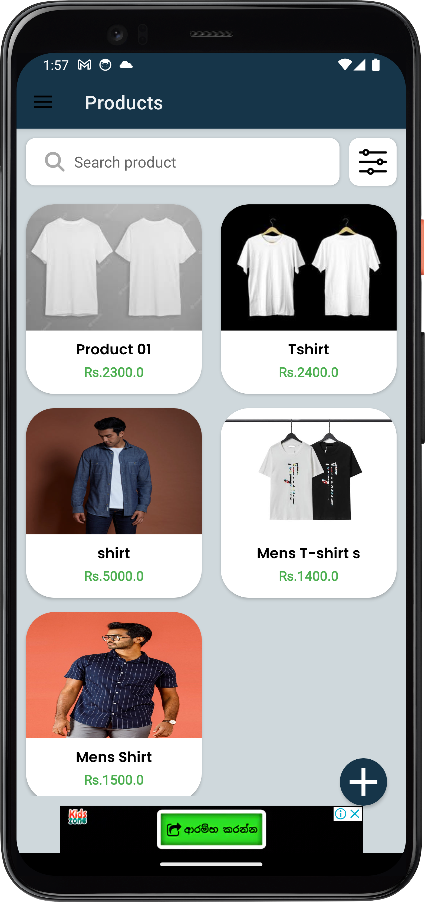

# T-Shirt Selling App

## Table of Contents
- [Screenshots](#Screenshots)
- [Introduction](#introduction)
- [Features](#features)

## Screenshot.

        &nbsp;&nbsp;
        &nbsp;&nbsp;
        &nbsp;&nbsp;
        &nbsp;&nbsp;
        &nbsp;&nbsp;
        &nbsp;&nbsp;
    

  

## Introduction

Welcome to the T-Shirt Selling App repository! This Android application is designed to provide a seamless and user-friendly platform for selling and buying your favorite t-shirts. Whether you're a t-shirt enthusiast looking to expand your collection or a seller wanting to reach a wider audience, this app has got you covered.

## Features

- **User-friendly Interface**: Our app offers an intuitive and visually appealing interface, making it easy for users to navigate and browse through a wide range of t-shirt options.

- **T-Shirt Listings**: Sellers can create detailed listings for their t-shirts, including high-quality images, descriptions, sizes, and prices.

- **Search and Filter**: Users can search for specific t-shirts or filter results based on various criteria such as size, color, and price range.

- **User Profiles**: Each user has a unique profile where they can manage their listings, view their purchase history, and keep track of their favorite t-shirts.

## Technologies Used

This app was developed using the following technologies:

- **Java**: The app's core functionality and logic are implemented in Java, a versatile and widely-used programming language for Android app development.

- **Firebase**: Firebase is utilized for backend services, including user authentication, real-time database, and cloud storage, ensuring a seamless and reliable user experience.

